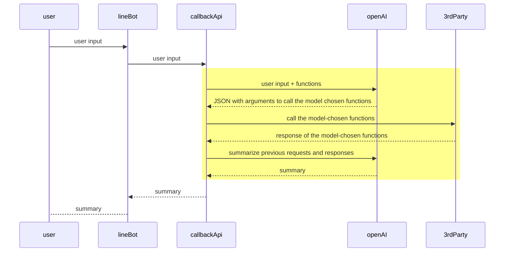

# LangChain Demo with LINE Bot

## Demo Example


## Architecture


## Call Flow with OpenAI Function Calling



## Run Web App Locally on PowerShell

```
$ python -m venv .venv
$ .\.venv\Scripts\activate
$ pip install -r requirements.txt
$ cd src && uvicorn main:app --host localhost --port 5000
$ curl http://localhost:5000/hello
```

## Deployment

### 1. Set up LINE Bot

- [LINE Developers Console](https://developers.line.biz/console/) > Create a Provider > Create a Messaging API Channel

### 2. Deploy Web App on Render

[](https://render.com/deploy)

- Blueprint Name
- LINE_CHANNEL_ACCESS_TOKEN
  - [LINE Developers Console](https://developers.line.biz/console/) > Provider > Messaging API > Channel access token
- LINE_CHANNEL_SECRET
  - [LINE Developers Console](https://developers.line.biz/console/) > Provider > Channel secret
- OPEN_API_KEY
  - [OpenAI API keys](https://platform.openai.com/api-keys) > Create new secret key

### 3. Set up Webhook on LINE Messing API

- [Render Blueprints](https://dashboard.render.com/blueprints) > Resources > Get `<web-service-url>`

- [LINE Developers Console](https://developers.line.biz/console/) > Provider > Messaging API > Webhook URL > Edit and Verify `<web-service-url>/callback` > Enable "Use webhook"
