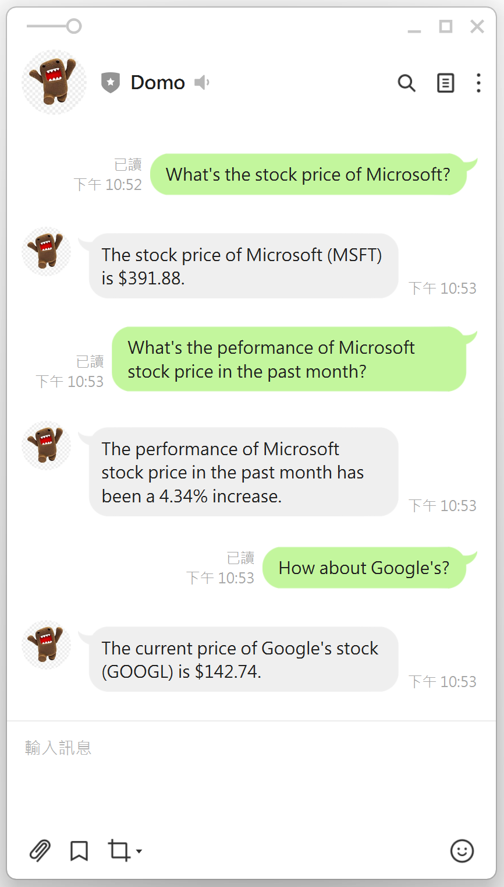
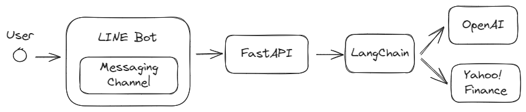
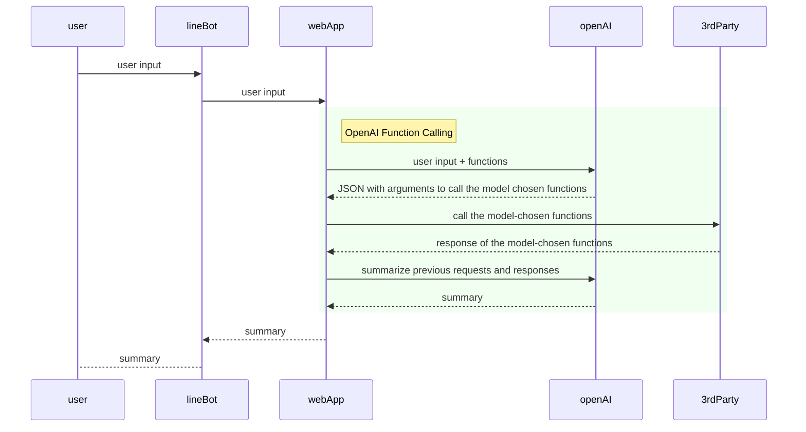
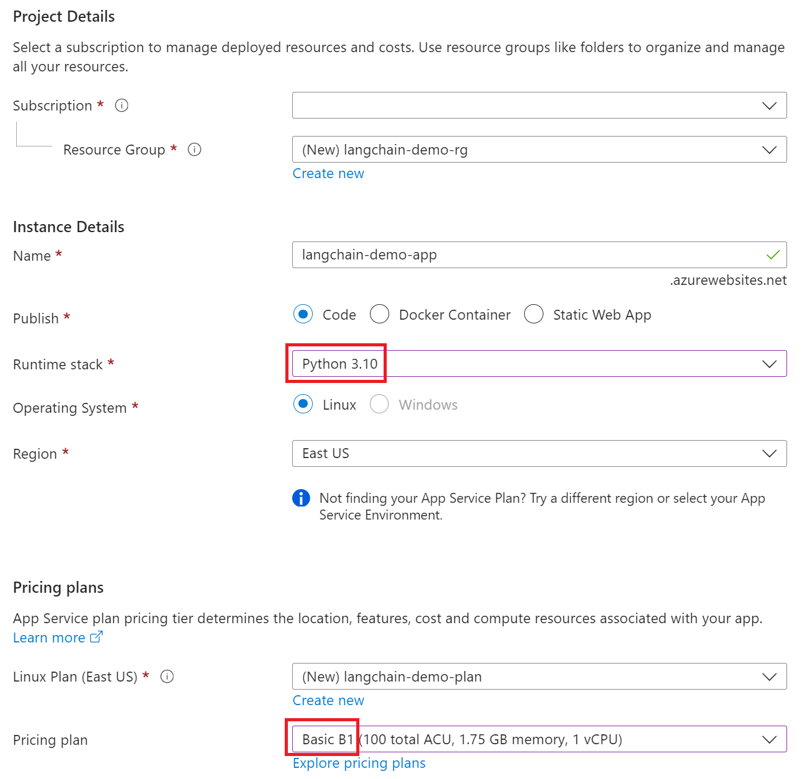
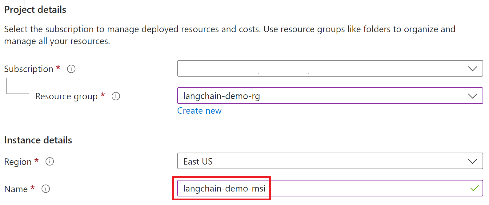
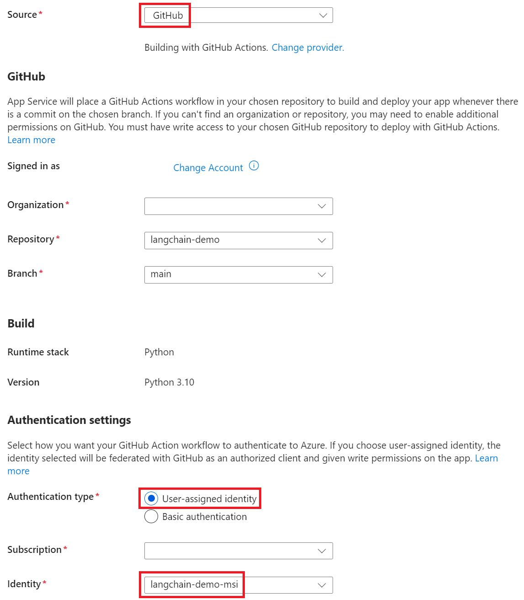
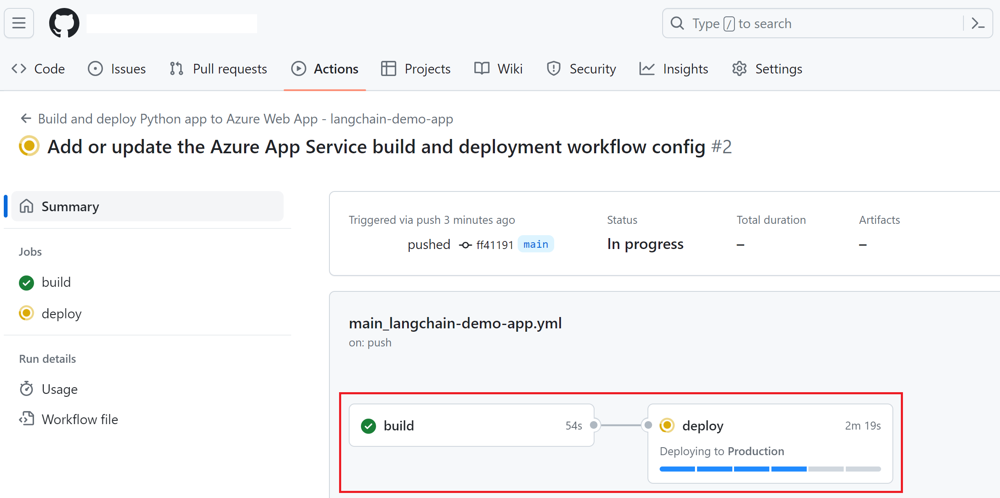

<!-- vscode-markdown-toc -->
- [LangChain Demo with LINE Bot](#langchain-demo-with-line-bot)
  - [Demo Example](#demo-example)
  - [Architecture](#architecture)
  - [Call Flow](#call-flow)
  - [Run Web App Locally](#run-web-app-locally)
  - [Deployment](#deployment)
    - [1. Set up LINE Bot](#1-set-up-line-bot)
    - [2. Run Web App Remotely](#2-run-web-app-remotely)
      - [Render](#render)
      - [Azure](#azure)
    - [3. Set up Webhook on LINE Messing API](#3-set-up-webhook-on-line-messing-api)

<!-- vscode-markdown-toc-config
	numbering=false
	autoSave=true
	/vscode-markdown-toc-config -->
<!-- /vscode-markdown-toc -->

# LangChain Demo with LINE Bot

## <a name='DemoExample'></a>Demo Example



## <a name='Architecture'></a>Architecture



## <a name='CallFlow'></a>Call Flow



## <a name='RunWebAppLocally'></a>Run Web App Locally

- Create .env file

  ```
  LINE_CHANNEL_SECRET=
  LINE_CHANNEL_ACCESS_TOKEN=
  OPENAI_API_KEY=
  ```

- Run commands on PowerShell

  ```
  $ python -m venv .venv
  $ .\.venv\Scripts\activate
  $ pip install -r requirements.txt
  $ cd src && uvicorn main:app --host localhost --port 5000
  $ curl http://localhost:5000/hello
  ```

## <a name='Deployment'></a>Deployment

### <a name='SetupLINEBot'></a>1. Set up LINE Bot

- [LINE Developers Console](https://developers.line.biz/console/) > Create a Provider > Create a Messaging API Channel

### <a name='RunWebAppRemotely'></a>2. Run Web App Remotely

#### <a name='Render'></a>Render

[](https://render.com/deploy)

1. Set Configuration

   - Blueprint Name
   - LINE_CHANNEL_ACCESS_TOKEN
     - [LINE Developers Console](https://developers.line.biz/console/) > Provider > Messaging API > Channel access token
   - LINE_CHANNEL_SECRET
     - [LINE Developers Console](https://developers.line.biz/console/) > Provider > Channel secret
   - OPEN_API_KEY
     - [OpenAI API keys](https://platform.openai.com/api-keys) > Create new secret key

2. [Render Blueprints](https://dashboard.render.com/blueprints) > Resources > Get `<web-service-url>`

#### <a name='Azurehttps:portal.azure.comhome'></a>[Azure](https://portal.azure.com/#home)

1. Create App Services > Web App



2. Web App > Configuration > Application settings > Advanced edit

``` json
[
  {
    "name": "LINE_CHANNEL_ACCESS_TOKEN",
    "value": "<LINE_CHANNEL_ACCESS_TOKEN>", 
    "slotSetting": false
  },
  {
    "name": "LINE_CHANNEL_SECRET",
    "value": "<LINE_CHANNEL_SECRET>", 
    "slotSetting": false
  },
  {
    "name": "OPENAI_API_KEY",
    "value": "<OPENAI_API_KEY>",  
    "slotSetting": false
  },
  {
    "name": "PYTHONUNBUFFERED",
    "value": "1",
    "slotSetting": false
  },
  {
    "name": "SCM_DO_BUILD_DURING_DEPLOYMENT",
    "value": "1",
    "slotSetting": false
  },
  {
    "name": "WEBSITE_WEBDEPLOY_USE_SCM",
    "value": "1",
    "slotSetting": false
  },
  {
    "name": "WEBSITES_CONTAINER_START_TIME_LIMIT",
    "value": "1800",
    "slotSetting": false
  }
]
```

3. Web App > Configuration > General settings > Startup Command

```
cd src && python -m uvicorn main:app --host 0.0.0.0
```

4. Web App > Configuration > General settings > HTTPS Only > Off

5. Create Managed Identities



6. Web App > Deployment Center > Settings



7. Github repository > Actions > Workflow in progress



8. Web App > Overview > Default Domain > Get `<web-service-url>`
  
### <a name='SetupWebhookonLINEMessingAPI'></a>3. Set up Webhook on LINE Messing API

- [LINE Developers Console](https://developers.line.biz/console/) > Provider > Messaging API > Webhook URL > Edit and Verify `<web-service-url>/callback` > Enable "Use webhook"
